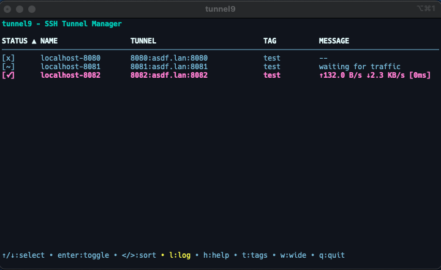
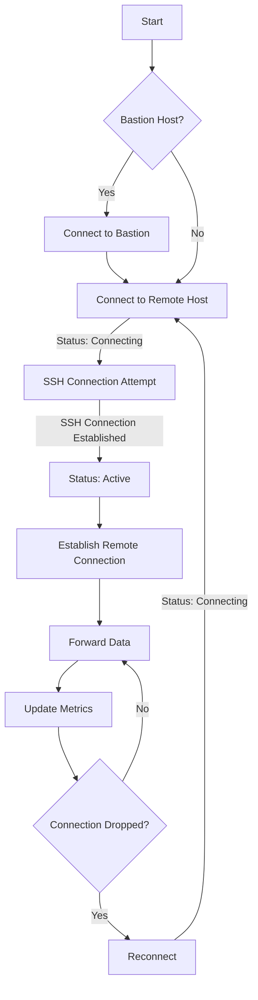

# tunnel9

A terminal user interface (TUI) for managing SSH tunnels.  Tunnel9 provides a simple, efficient way to manage multiple SSH port forwarding configurations with real-time monitoring of throughput and latency.



Many thanks to [How to Create An SSH Tunnel in Go](https://elliotchance.medium.com/how-to-create-an-ssh-tunnel-in-go-b63722d682aa) by Elliot Chance and [A Visual Guide to SSH Tunnels: Local and Remote Port Forwarding](https://iximiuz.com/en/posts/ssh-tunnels/) by Ivan Velichko.

## Features

- Simple terminal-based UI for managing SSH tunnels
- Real-time monitoring of tunnel performance (throughput and latency)
- Support for bastion/jump host configurations
- Tag-based organization and filtering
- Column-based sorting and organization

## Architecture Haiku

- Go (backend)
- [Bubble Tea](https://github.com/charmbracelet/bubbletea) (TUI framework)
  - [Bubbles](https://github.com/charmbracelet/bubbles) (Bubble Tea components)
  - [Lipgloss](https://github.com/charmbracelet/lipgloss) (Terminal styling)
- SSH integration
  - `golang.org/x/crypto/ssh` (SSH client)
  - `ssh_config` (SSH config parsing)
- [docopt](https://github.com/docopt/docopt-go) (CLI argument parsing)
- YAML for configuration (`gopkg.in/yaml.v3`)

## Interface

### Controls

- Navigation
  - `↑/↓` - Move selection
  - `Enter` - Toggle tunnel on/off
  - `</>` - Change sort column
- Management
  - `n` - Create new tunnel
  - `e` - Edit selected tunnel
  - `d` - Delete selected tunnel
- Display
  - `t` - Select tags to filter
  - `?` - Toggle help
  - `q` - Quit application

### Status Indicators

- `[✓]` - Tunnel Active
- `[x]` - Tunnel Stopped
- `[!]` - Connection Error
- `[~]` - Connecting...

## Configuration

Tunnels are configured using YAML format:

```yaml
tunnels:
  - host: "db.example.com"
    alias: "prod-db"  # optional
    user: "dbuser"
    local_port: 5432
    remote_port: 5432
    tag: "production"  # optional
    bastion:           # optional
      host: "jump.prod"
      user: "jumpuser"
```

## Installation

Run the install script:

```
bash -c "$(curl -fsSL https://raw.githubusercontent.com/sio2boss/tunnel9/main/tools/install.sh)"
```

or

1. Download the latest release from the releases page
2. Extract the archive:
   ```bash
   tar xzf tunnel9-*.tar.gz
   ```
3. Copy the binary to your local bin directory:
   ```bash
   mkdir -p ~/.local/bin
   mv tunnel9 ~/.local/bin/
   chmod +x ~/.local/bin/tunnel9
   ```
4. Ensure `~/.local/bin` is in your PATH. Add this to your `~/.bashrc` or `~/.zshrc`:
   ```bash
   export PATH="$HOME/.local/bin:$PATH"
   ```
5. Restart your shell or source your rc file:
   ```bash
   source ~/.bashrc  # or source ~/.zshrc
   ```


## Development

```
go mod tidy
make
```

Right now we have a patched version of ssh_config...

Additional tools:
```
brew install vhs
brew install ttyd --HEAD
go get -u gotest.tools/gotestsum
```

## Connection State Transitions

